#### SECCIÓN I (CRUD con MySQL)
- Creacion de Base de datos y tabla
> Ruta de respositorio (https://github.com/whilrod/prueba-vise/tree/main/seccion1_crud_mysql_python)
```
CREATE DATABASE gestion_usarios;
USE gestion_usarios;

CREATE TABLE IF NOT EXIST usuarios(
    id INT PRIMARY AUTO_INCREMENT,
    nombre varchar(100) NOT NULL,
    email varchar(100) NOT NULL,
    fecha_creacion TIMESTAMP DEFAULT CURRENT_TIMESTAMP
)
```

tabla usuarios
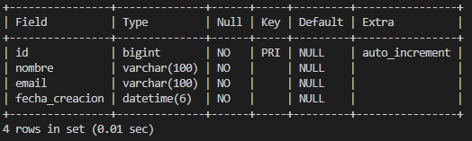
- home
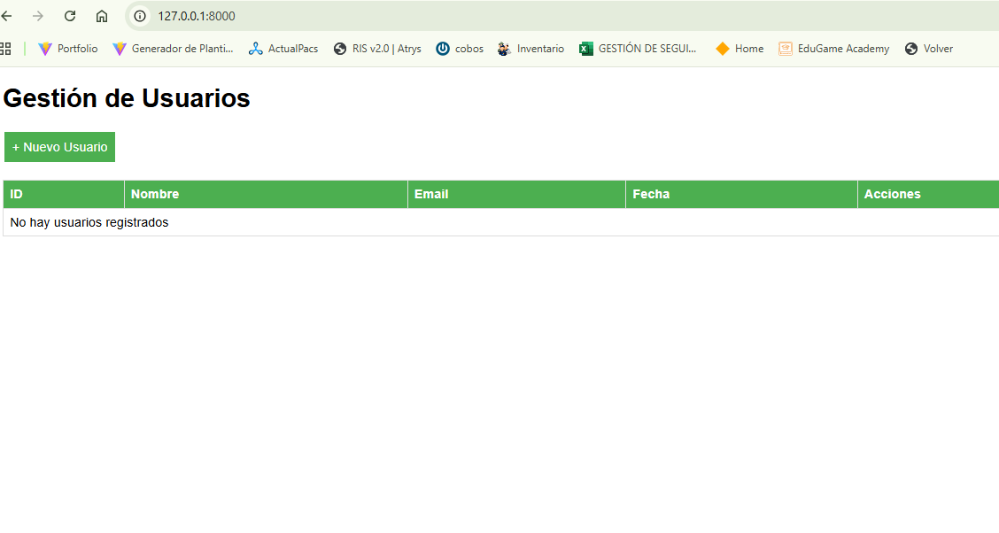
- crear
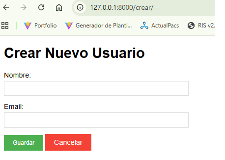
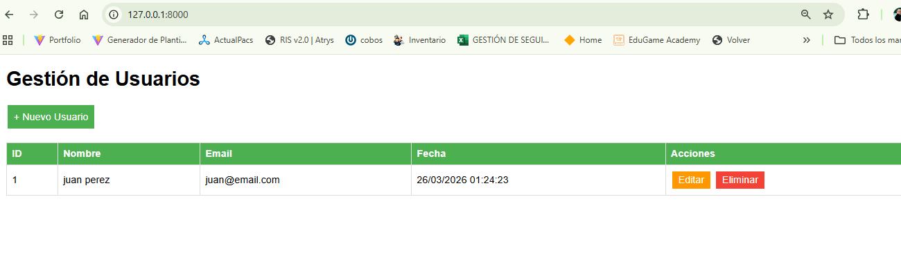
- editar
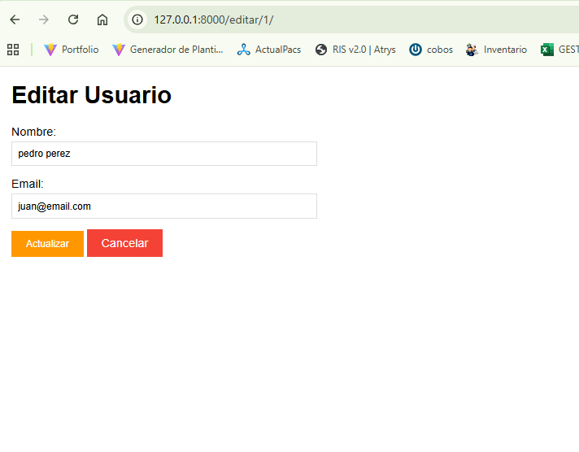
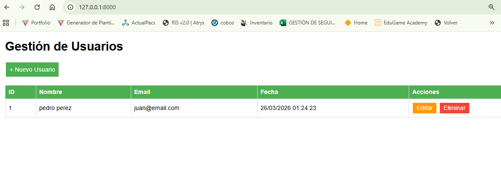
- crear nuevo
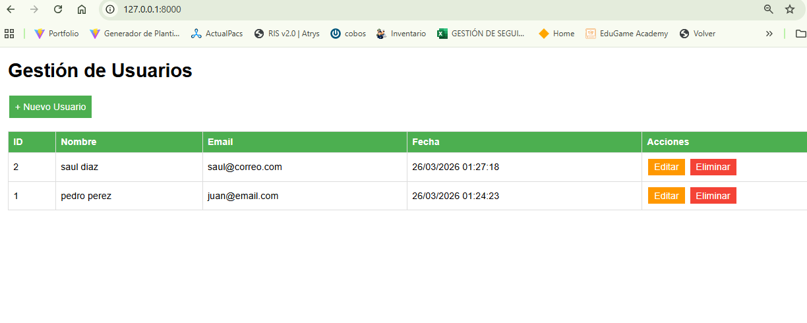
- eliminar
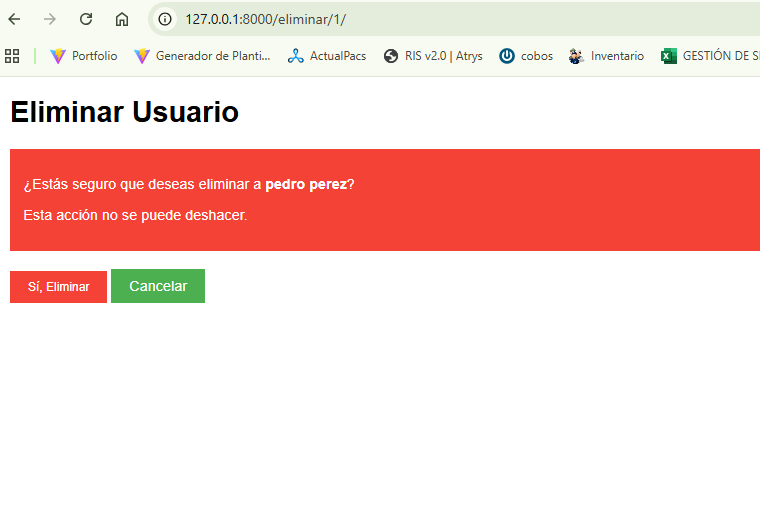
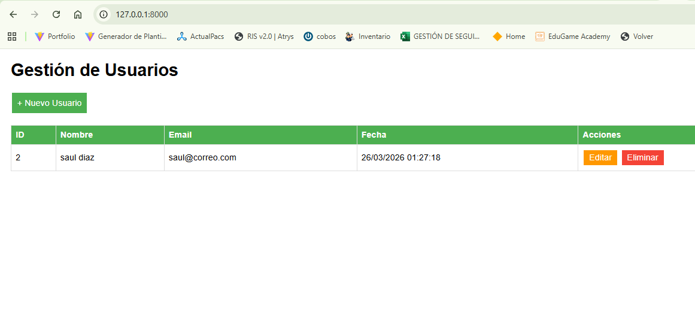

## SECCIÓN II Desarrollo de Aplicaciones Móviles
> Ruta repositorio https://github.com/whilrod/prueba-vise/tree/main/seccion2_desarrollo_aplicaciones_moviles/lib
- home - crear
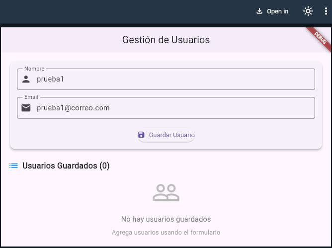
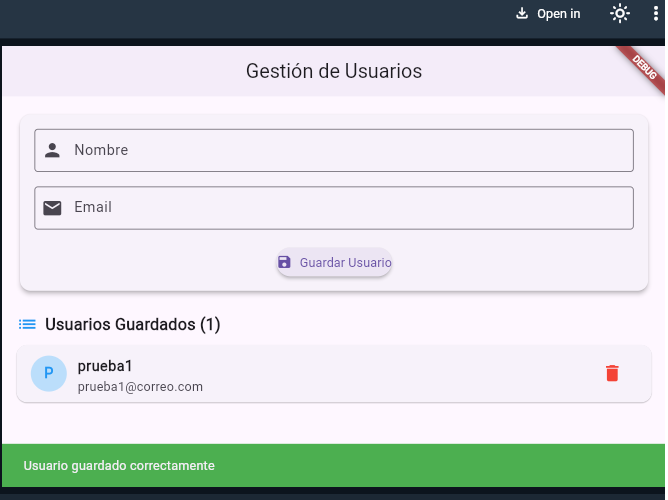
- validación de datos
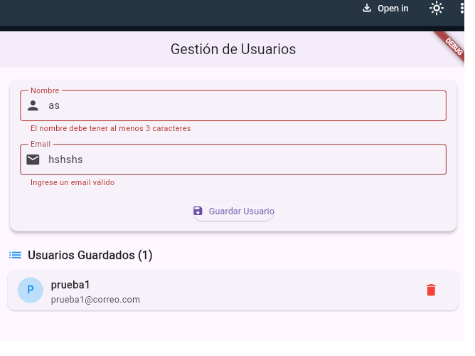
-datos guardados
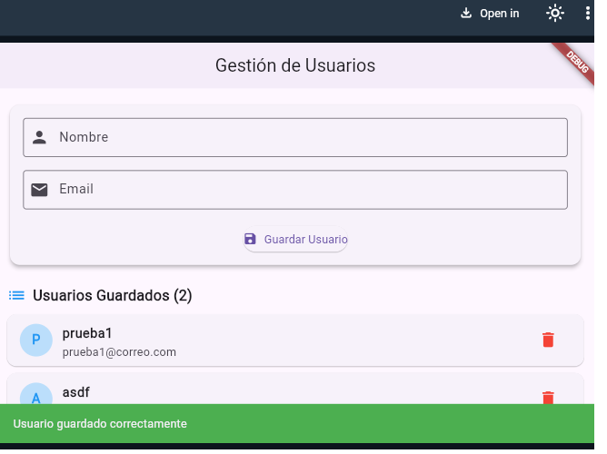
-eliminacion de registro
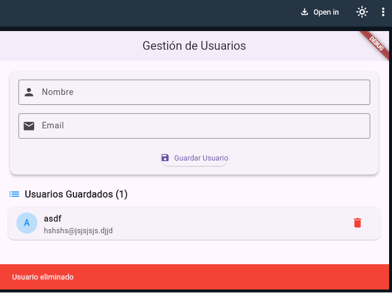

## SECCIÓN III RPA
##### Prereqisitos: Selenium Basic para MsExcel y Driver Chrome actualizado

- En un nuevo modulo en programador de Excel:
- ejecutar
> ruta a repositorio https://github.com/whilrod/prueba-vise/tree/main/seccion3_rpa

En la columna _cedulas_ pueden ir tantas como sea necesario
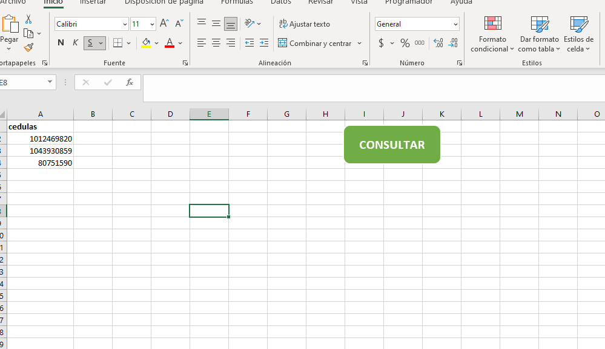
página de busqueda
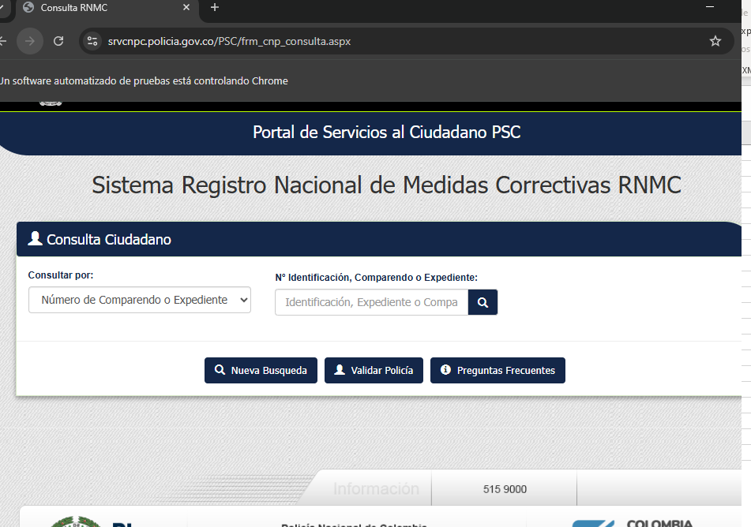
ingreso de documento
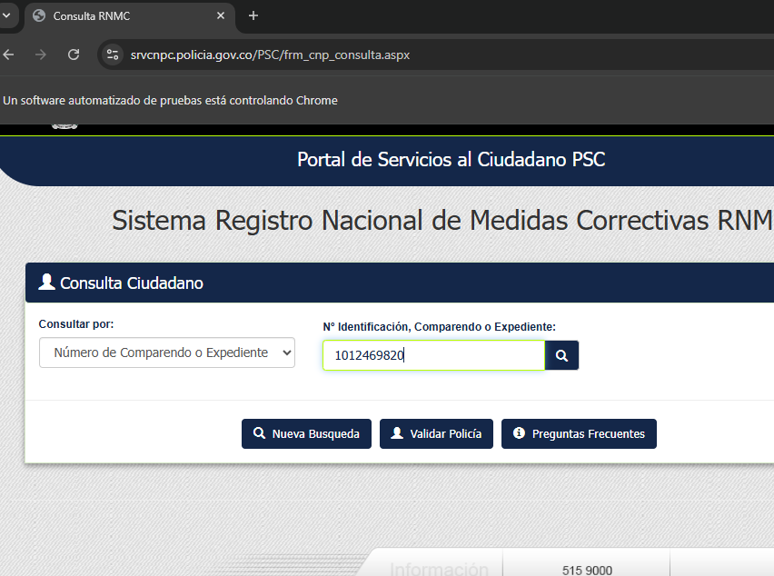
Respuesta de la busqueda
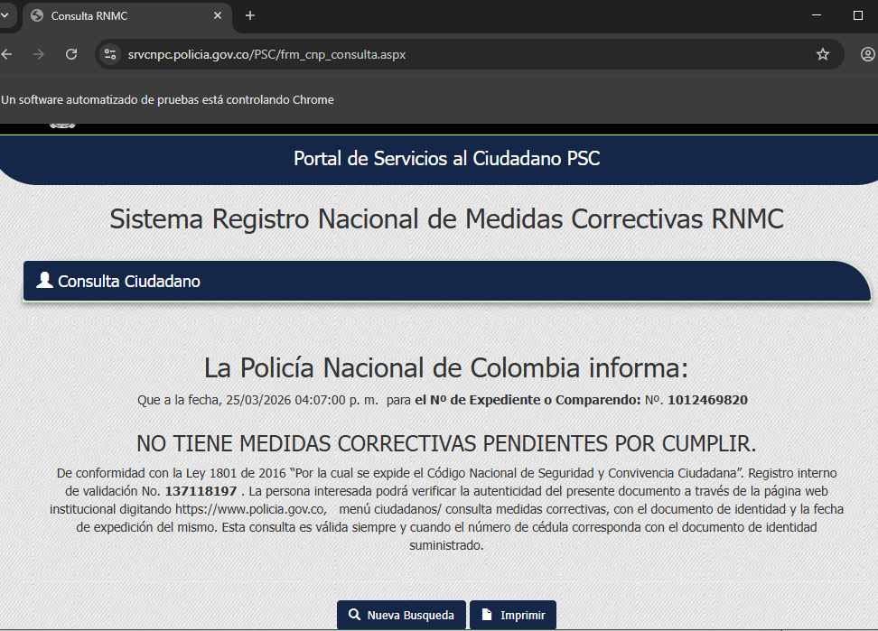
Respuesta añadida al Excel
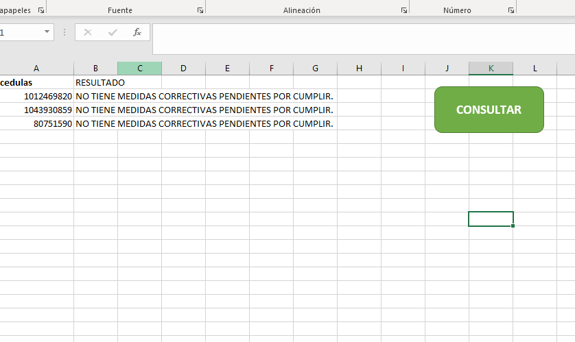
Video explicativo de la prueba
<video controls src="pruebaRPA.wmv" title="Title"></video>

```
Sub automatizar()
    Dim driver As New Selenium.ChromeDriver
    Dim fila As Long
    Dim ultimaFila As Long
        
    Dim ws As Worksheet
    Set ws = ThisWorkbook.Sheets("Hoja1")
    
     URL_Pagina = "https://srvcnpc.policia.gov.co/PSC/frm_cnp_consulta.aspx"
     CEDULA = "//*[@id='ctl00_ContentPlaceHolder3_txtExpediente']"
     BOTON_Buscar = "//*[@id='ctl00_ContentPlaceHolder3_btnConsultar']"
     RESPUESTA = "//*[@id='ctl00_ContentPlaceHolder3_respuesta4']/div/div[1]/h3"
     NUEVA_Busqueda = "//*[@id='ctl00_ContentPlaceHolder3_btnNuevo3']"
     
     driver.Start "chrome"
      Do
        On Error Resume Next
        driver.Get URL_Pagina
        On Error GoTo 0
        driver.wait 3000
        If driver.Title <> "" Then
            Exit Do ' Salir del bucle si se carga la página
        End If
        DoEvents
    Loop While driver.Title <> ""
    Cells(1, 2).Value = "RESULTADO"
    ultimaFila = Cells(Rows.Count, 1).End(xlUp).Row
    For i = 2 To ultimaFila
        driver.FindElementByXPath("//*[@id='ctl00_ContentPlaceHolder3_txtExpediente']").Click
        driver.FindElementByXPath(CEDULA).SendKeys Cells(i, 1).Value
        driver.wait (1000)
        driver.FindElementByXPath(BOTON_Buscar).Click
        Cells(i, 2).Value = driver.FindElementByXPath(RESPUESTA).Text
        driver.wait (1000)
        driver.FindElementByXPath(NUEVA_Busqueda).Click
       
    Next i
    MsgBox "Consulta de " & i - 2 & " cédulas terminada", vbInformation, "Proceso finalizado"
        
End Sub
``` 
## SECCIÓN V  (PostgreSQL)

> Ruta repositorio https://github.com/whilrod/prueba-vise/tree/main/seccion5_postgres_sql

> creacion tabla empleados
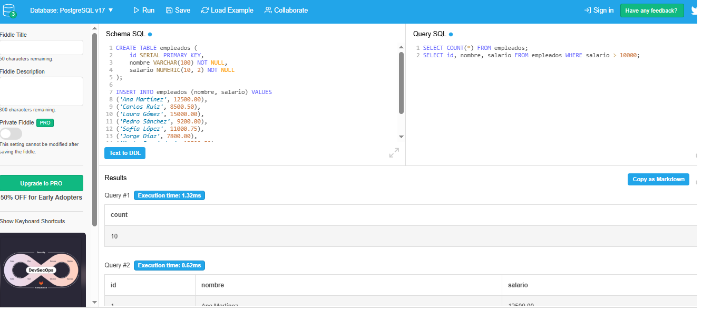
> query de consulta
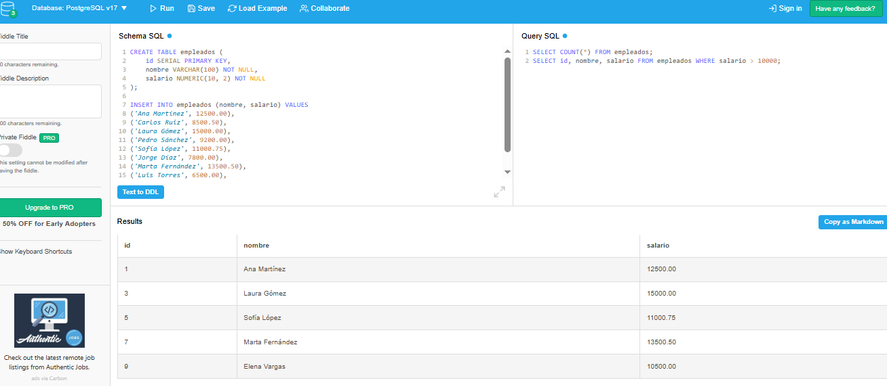

